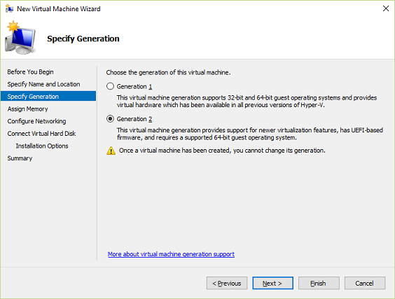
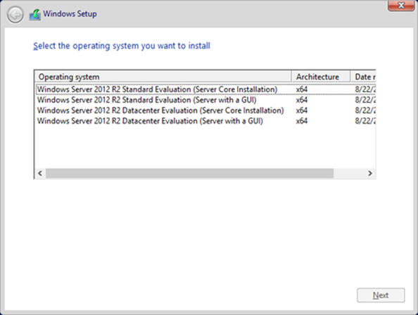
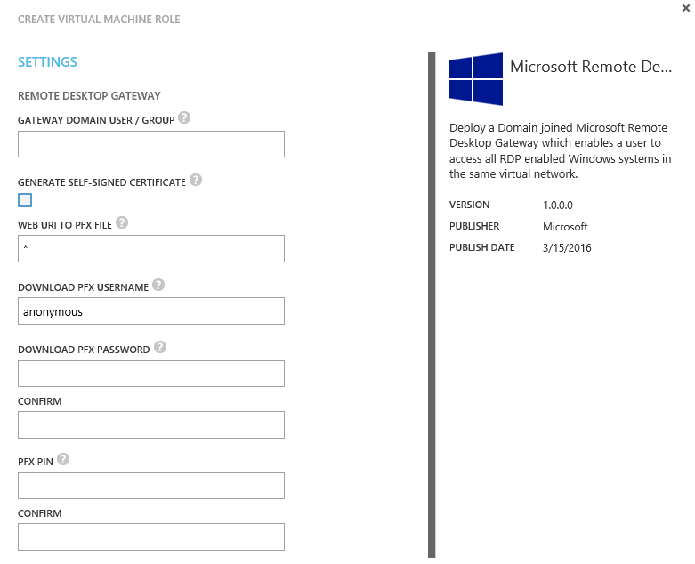
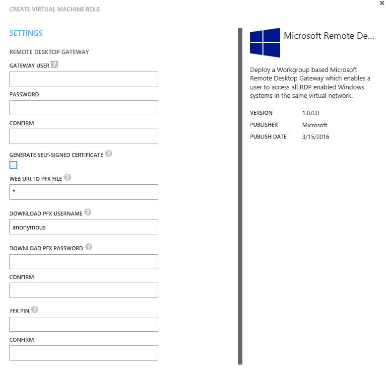

#Remote Desktop Gateway
Windows Azure Pack Gallery Resource

## Overview
The Remote Desktop Gateway gallery resources enable a service provider to publish a gallery item for tenants to deploy either a workgroup based or an Active Directory Domain joined Remote Desktop Gateway virtual machine role on Windows Server 2012 R2. Additionally, the user may bring his own certificate by making it available on a web URI.
In order to publish the gallery resources as a gallery item, you must: 
- Import the resource extension package into System Center Virtual Machine Manager.
- Ensure the virtual hard disks in SCVMM are properly prepared and have all the necessary properties set.
- Import the resource definition package as a gallery item.
- Make the gallery item public.
- Add the gallery item to a plan.

##System Center Virtual Machine Manager 
In order to use a gallery resource, you must take the following actions in System Center Virtual Machine Manager.
###Import Resource Extension Package
Using PowerShell, you must import the resource extension package into the virtual machine manager library.  
Sample Windows PowerShell:
```PowerShell
$libsharepath = '' #you must set the library sharepath from your environment
$resextpkg = 'c:\GalleryResources\RDSGW\RDSGWWorkgroup.resextpkg'
Import-CloudResourceExtension –ResourceExtensionPath $resextpkg  –SharePath $libsharepath -AllowUnencryptedTransfer
```
The import can only be done using PowerShell.
To verify the import, run the Get-CloudResourceExtension PowerShell command and locate the newly imported extension.
```PowerShell
Get-CloudResourceExtension
```
###Prepare the virtual hard disks
A virtual hard disk containing a sysprepped version of one of the available editions of Windows Server 2012R2 must be added to a SCVMM library share.
####[Option 1] Download Evaluation
Evaluations  of Windows Server 2012R2 can be downloaded at the evaluation center: https://www.microsoft.com/en-us/evalcenter/evaluate-windows-server-2012-r2
####[Option 2] Prepare your own OS disk
You can prepare your own OS disk instead of using the Evaluation edition option mentioned before. To do this:
- Create a new VM. Make sure you choose the VM generation for which the VM Role will be created (you can't deploy Gen1 vhdx images to a Gen2 enabled cloud and vice versa).  
  
- Install one of the supporting Windows Server versions to it. Only UI is supported.
  
    - Windows Server 2012 R2 Datacenter Preview
    - Windows Server 2012 R2 Standard Preview  
- [optional] Fully patch the OS
- Run sysprep to generalize the image
```bat
Sysprep.exe /generalize /oobe /shutdown
```
####Library properties
Once the VHDx Files are added to the library and have been discovered, they need to be updated with the correct metadata.
```PowerShell
#Example Gen2
Get-SCVirtualHardDisk -Name Win2012R2.vhdx | Set-SCVirtualHardDisk -Tag @('WindowsServer2012','R2') -Release 1.0.0.0 -FamilyName 'Windows Server 2012 R2 UEFI' -VirtualizationPlatform HyperV
#Example Gen1
Get-SCVirtualHardDisk -Name Win2012R2.vhdx | Set-SCVirtualHardDisk -Tag @('WindowsServer2012','R2') -Release 1.0.0.0 -FamilyName 'Windows Server 2012 R2' -VirtualizationPlatform HyperV
```
Note: Also specify a product key for the VHDx if you created your own OS disk
```PowerShell
Get-SCVirtualHardDisk -Name Win2012R2.vhdx | Set-SCVirtualHardDisk -ProductKey 'Enter Product Key here'
```
###Windows Azure Pack Service Administrator Portal
Once the resource extension and virtual hard disk are all correctly set in SCVMM, you can import the resource definition package using the Service Administrator Portal in the Windows Azure Pack.
####Import Resource Definition Package 
- Open the Service Admin Portal.
- Navigate to the VM Clouds workspace.
- Click the Gallery tab.
- Click Import.
- To enable WORKGROUP-based virtual machine role deployments, select and import the RDSGWWorkgroup.resdefpkg file in the unzipped location. 
- To enable Active Directory Domain join virtual machine role deployments, select and import the RDSGWDomain.resdefpkg file in the unzipped location.
- Note that the gallery item now is listed on the Gallery tab.
Now that the packages for the Virtual Machine Role have been installed, you can publish the gallery item to make it available to tenants.
####Publish gallery item and add to a plan
To make the Virtual Machine Role available to the tenant, you need to add it to a plan. In this procedure, you publish the Virtual Machine Role that you installed.
- On the Gallery tab, select the version of the gallery item that you just imported.
- Click the arrow next to the gallery item name.
- Explore the details of the gallery item.
- Navigate back and click Make Public.
- Select the Plans workspace in the Service Admin Portal.
- Select the plan to which you want to add this gallery item.
- Select the Virtual Machine Clouds service.
- Scroll to the Gallery section.
- Click Add Gallery Items.
- Select the gallery items that you imported, and then click Save.  
The Virtual Machine Role is now available to the tenant as part of the selected plan.

##Deployment settings
When deploying this virtual machine role, the user provides mandatory and optional values:  
**Domain:**  


**Workgroup:**  


The main difference between the domain and workgroup version is the Gateway user.
The domain VM Role will add an exising domain user / group to the local RDGW permission group.  
The workgroup VM Role will create a new local user and add it to the RDGW permission group.  
- **Generate Self-Signed Certificate**  
When you check this box, a self-signed certificate will be generated and bound to the RDGW listener.  
When you leave it unchecked, a PFX will be downloaded using details provided in other options. The certificate in the PFX will be bound to the RDGW listener.
- **Web URI to PFX File**  
The PFX must be on an accessible URI.
- **Download PFX Username**  
If the PFX URI requires authentication, a username must be provided here.  
If no authentication is required, leave the username as anonymous.
- **Download PFX Password**  
If the PFX URI requires authentication, a password must be provided here.  
If no authentication is required, leave the username as anonymous and just enter some matching characters here.
- **PFX Pin**  
If a PFX is used, it will have a pin. Enter the pin needed to access the PFX archive.

Note that if you bring in a certificate using the PFX option, you must create the PFX with the option to include all certificates in the certificate path as well as the private key.

##Exposing Remote Desktop Gateway to Public IP

Once the VM Role has been deployed, the tenant can expose the RDGW to the Internet by creating a NAT rule on the VM Network.
  
Next the tenant should create a DNS alias or local host entry for name resolution.  
If a self-signed certificate was used, the certificate must be imported on the local machine as a trusted root certificate.